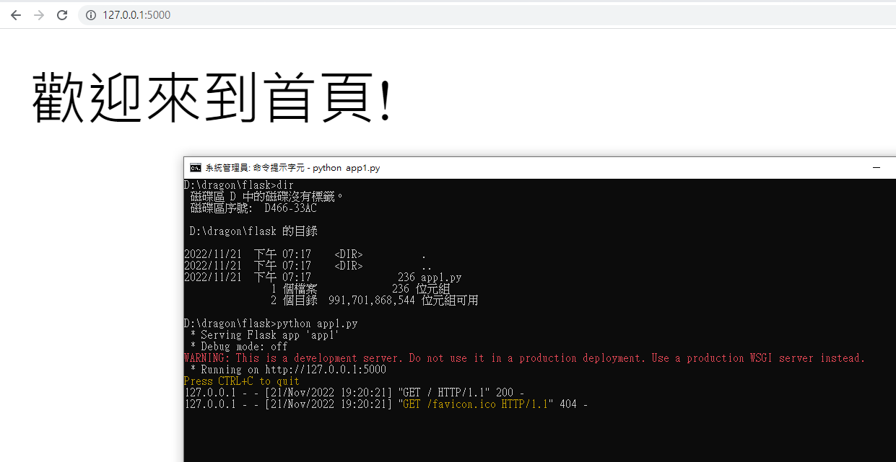

# 平台建置
- 先安裝PYTHON
- 更新PIP
```
python.exe -m pip install --upgrade pip
```
- 安裝FLASK
```
pip install flask
```


## 使用 notepad++開發第一支程式 app1.py
```python
from flask import Flask
app = Flask(__name__)

@app.route('/')
def index():
    return '歡迎來到首頁!'

@app.route('/hello')
def hello():
    return '歡迎來到歡迎頁面!'

if __name__ == '__main__':
    app.run()
```
## 執行程式 python app1.py
## 成功畫面 


## 安裝PostgreSQL資料庫
```
C:\Program Files\PostgreSQL\15

C:\Program Files\PostgreSQL\15\data

postgres\@@@ksu2022$%$$%

5432
```
```
Installation Directory: C:\Program Files\PostgreSQL\15
Server Installation Directory: C:\Program Files\PostgreSQL\15
Data Directory: C:\Program Files\PostgreSQL\15\data
Database Port: 5432
Database Superuser: postgres
Operating System Account: NT AUTHORITY\NetworkService
Database Service: postgresql-x64-15
Command Line Tools Installation Directory: C:\Program Files\PostgreSQL\15
pgAdmin4 Installation Directory: C:\Program Files\PostgreSQL\15\pgAdmin 4
Stack Builder Installation Directory: C:\Program Files\PostgreSQL\15
Installation Log: C:\Users\user\AppData\Local\Temp\install-postgresql.log
```
## 安裝連線到PostgreSQL資料庫的模組套件
```
pip install flask_sqlalchemy
pip install psycopg2-binary #for using postgres
```


## flask參考書目
- [Python Flask Web 開發入門與項目實戰](https://www.tenlong.com.tw/products/9787111630883?list_name=srh)
- [Flask Web 開發從入門到精通, 2/e (Flask Framework Cookbook, 2/e)](https://www.tenlong.com.tw/products/9787302556992?list_name=srh)
- [Flask Web 開發實戰：入門、進階與原理解析 Flask Web开发实战:入门、进阶与原理解析 李輝](https://www.tenlong.com.tw/products/9787111606598?list_name=srh)
- [Flask Web 開發入門、進階與實戰 張學建](https://www.tenlong.com.tw/products/9787111673170?list_name=srh)
